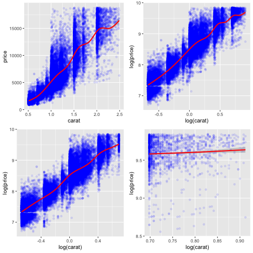
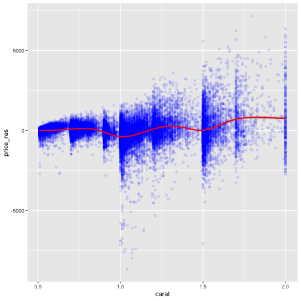

Diamonds: using linear regression to predict prices
========================================================
author: Raphael Moline
date: 15th July 2019
autosize: true

Exploratory data analysis
========================================================

Exploratory datat analysis can be done using the shiny app at the link below <https://raphael-moline.shinyapps.io/myapp/>.

- Price increase with size (weigth in carat), although not linearly
- Clarity, cut and color seem to be having an influence on the price
- Multiple linear regression will be used to try model the diamond price as a function of these variables



Following some exploratory data analysis with the shiny app:

1) I removed diamonds with weights below 0.5 and above 2.5 carats

2) I split the data at 2 carats

3) log(price) vs log(carat) seems to exhibit more linearity than price vs carat


Running linear regression on diamonds (less than 2 carats)
========================================================


```r
diamonds <- filter(diamonds, carat<=2)
fitlog_low <- lm(log(price) ~ log(carat), diamonds)
fit_cut <- lm(log(price) ~ log(carat) + cut, diamonds)
fit_clarity <- lm(log(price) ~ log(carat) + clarity, diamonds)
fit_color <- lm(log(price) ~ log(carat) + color, diamonds)
fit_all <- lm(log(price) ~ log(carat) + cut + color + clarity, diamonds)
c(summary(fitlog_low)$r.squared, summary(fit_cut)$r.squared,summary(fit_color)$r.squared,
  summary(fit_clarity)$r.squared, summary(fit_all)$r.squared)
```

```
[1] 0.8324143 0.8457937 0.8698297 0.9193809 0.9673551
```

- Clarity seems to have the the biggest influence after carat
- Combining with color and cut gets better results

Looking at prices and residuals
========================================================


```r
carat <- exp(fit_all$model$`log(carat)`)
price <- exp(fit_all$model$`log(price)`)
price_res <- (exp(fit_all$fitted.values) - price)
simul = cbind(carat, price_res) %>% tbl_df()
ggplot(simul, aes(x=carat, y=price_res)) + geom_point(colour = "blue", alpha = .1) +
    geom_smooth(colour="red")
```



Residuals are displaying non normality characteristics:

1) heteroskedasticity: the variation is higher for big diamonds. This is to be expected due to the log regression though

2) bias: it is not centered on zero, expected residual changes according to the size


